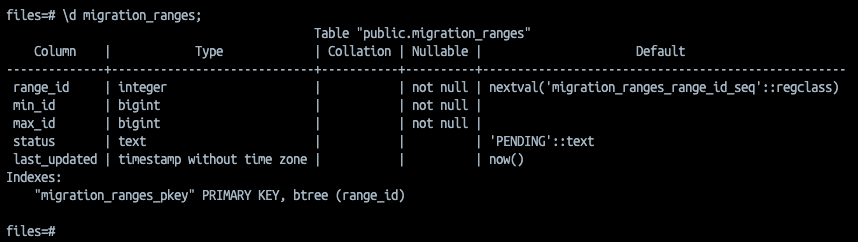
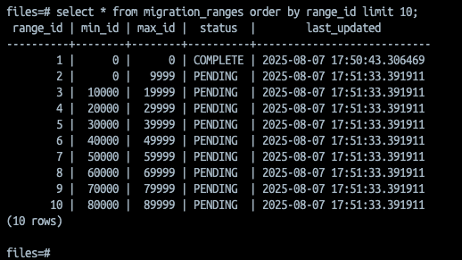
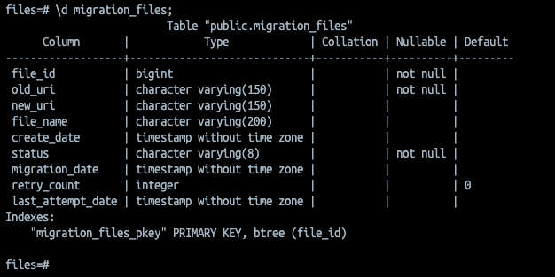
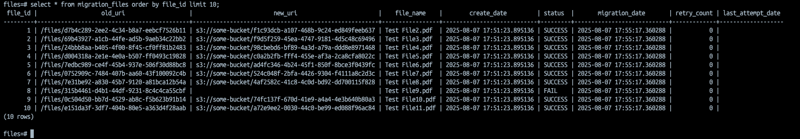

# file-migration

Example project leveraging parallelized workers responsible for moving files from one file storage system to another (i.e. on-prem storage to cloud storage).

## Overview

- Jobs only run during run windows, if enabled (nightly and weekends only)
- 20 worker threads
  - Each thread will process 10,000 files per execution based on available migration ranges in DB 
  - Executions schedule immediately after last run per thread -- if no records are processed, a backoff period is used (30s, 5 mins, 10 mins, 30 mins, 60 mins)
  - Each execution scans the source table(s) based on the current range sequences
- 1 seed thread 
  - This will expand the migration range table which the worker threads use to migrate ranges 
  - Runs hourly
- 5 retry threads 
  - Scans the migration files table for failed records -- will retry in batches of 500 per thread 
  - Files will be retried up to 3 times -- after that, it will stay in FAIL state 
  - Run every thirty minutes 
  - Also leverages backoff periods (30s, 5 mins, 10 mins, 30 mins, 60 mins) if no records are processed during execution
- 1 cleanup thread 
  - Scans migration ranges table for ranges that are stuck in PROCESSING state for > 60 minutes
      - This likely indicates bad state; possibly DB connection issues or container crashed 
  - Releases the "stuck" ranges back to PENDING status so they can be processed again 
  - Runs hourly

## Database Structure

### migration_ranges

#### Description

Stores ranges which specify min and max file IDs to process per batch; this allows worker threads to process batches in parallel.

#### DDL

#### Snapshot

### migration_files

#### Description

Stores individual file migration data.

#### DDL

#### Snapshot

